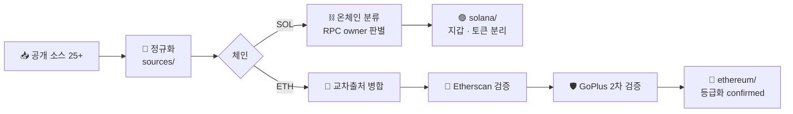

# ⚙️ Pipeline



## 일상 실행

```bash
python scripts/refresh_all.py            # 전체 갱신 (매일 자동 실행되는 그것)
python scripts/refresh_all.py --no-crawl # 크롤 생략, 재빌드만
```

- 매일 10:00 Windows 작업 스케줄러 `ScamDataRefresh` → `refresh_task.cmd`
- 단계 실패 시 다음 단계 진행 (이전 산출물 재사용) — 실패는 `MANIFEST.json`의 `refresh_failures`
- Etherscan 검증: `ETHERSCAN_KEY` 환경변수 또는 `~/.etherscan_key` 필요 (이어받기)
- GoPlus 검증: 키 불필요, 일일 상한 `GOPLUS_MAX` (기본 4,000)

## 스크립트 목록

| 단계 | 스크립트 | 역할 |
|---|---|---|
| 수집 | `crawl_chainabuse.py` | 최초 전량 크롤 (GraphQL proxy, cursor) |
| 수집 | `refresh_chainabuse.py` | **증분 크롤 (front-fill)** — 갱신은 반드시 이걸로 |
| 수집 | `crawl_chainpatrol.py` | ChainPatrol 자산 |
| 수집 | `fetch_stablecoin_blacklists.py` | USDT/USDC 동결 이벤트 (getLogs, 블록 증분) |
| 정규화 | `process.py` `process_gov.py` `process_extra.py` `process_academic.py` | 소스별 → 표준 스키마 |
| 정규화 | `process_chainabuse_crawl.py` | 신고 → 주소 단위 카테고리화 |
| 정규화 | `process_ethlabels_v2.py` `process_tayvano.py` `process_gov_updates.py` `process_labeled_updates.py` | 라이브 소스 재수집·분리 추출 |
| 분류 | `classify_solana.py` | SOL 주소 온체인 판별 (WALLET/TOKEN/PROGRAM/EMPTY) |
| 분류 | `resolve_creators.py` `build_rugcheck_creators.py` | RugCheck creator 역추출·집계 |
| 빌드 | `build_master.py` | 교차출처 병합 → 체인별 마스터 |
| 빌드 | `build_wallets.py` | SOL 지갑/토큰 분리 마스터 |
| 검증 | `verify_etherscan.py` | Etherscan getaddresstag 배치 (이어받기) |
| 검증 | `verify_goplus.py` | GoPlus address_security (이어받기·락파일) |
| 등급화 | `build_eth_verified.py` | tier 부여 → confirmed/최엄격/아카이브 |
| 총괄 | `refresh_all.py` | 위 전부를 순서대로 (오케스트레이터) |

## 방법론 노트

- **Chainabuse**: 프론트엔드 내부 GraphQL 프록시를 무인증 cursor 페이지네이션으로 전량 수집.
  목록이 최신순이라 갱신은 front-fill(아는 report id 연속 3페이지 만날 때까지)로.
- **지갑/토큰 분리**: `getMultipleAccounts` owner — System Program=지갑, Token 프로그램=토큰 mint, 계정 없음=EMPTY(드레인).
- **검증이 왜 중요한가**: dawsbot 스크랩 4,192개 중 Etherscan rep 2 확정은 229개뿐 (take-action 배너 ≠ 공식 악성).
  스크랩을 맹신하지 않고 API로 재검증하는 이유.
- **GoPlus 채택 기준**: phishing_activities·stealing_attack·blackmail_activities·cybercrime·sanctioned만.
  blacklist_doubt(의심)·honeypot_related(연관성)·mixer는 불채택.
